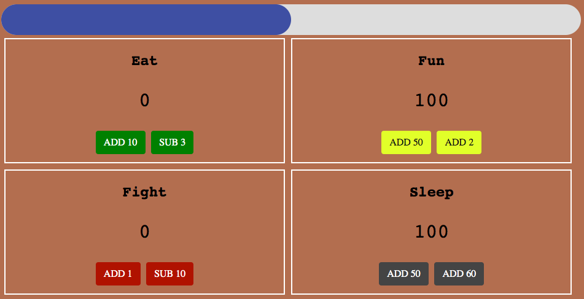

# Tamagotchi

Playing around w/Tamagotchi, js modules, and SASS. It's not perfect but it's mine 🙃

todo:

* Picture?
* Randomize Attrs instead of hardcoding them (i.e. values when you click buttons)
* Death: if any of the attrs go to 0 or below
* Module Interactivity
    * fullness at 100? Food coma (energy down)
    * Fullness down? Strength down too
    * Strength down? Energy, full, fun goes down
    * etc etc etc

